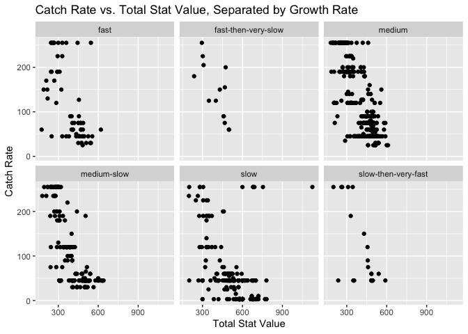

<!-- README.md is generated from README.Rmd. Please edit that file -->

# pokemon 

<!-- badges: start -->

[](https://lifecycle.r-lib.org/articles/stages.html#stable)
[](https://CRAN.R-project.org/package=pokemon)

<!-- badges: end -->

`pokemon` is an R package that contains Pokémon-related datasets. The
first Pokémon video game came out in 1996, and Nintendo has since
released nine generations of games, including 37 individual games in the
main series. It is one of the best-selling video game series and is
actively played by millions of people. The Pokédex is a comprehensive
collection of stats for all Pokémon in the series, which has made it the
most common Pokémon-related data to collect. However, in the past, only
a limited subset of Pokédex data was available in data sets, so this
package expands the availability by including data sets related to items
and moves, plus an expanded Pokédex. Our datasets use information
retrieved from PokéAPI (<https://pokeapi.co>), a public database of
Pokémon-related data with an API interface. However, our package is not
a wrapper package for the API, as it solely contains the datasets
automatically available to the user. Our goal in creating this package
is to make a design that allows users to view and easily interact with
extensive Pokémon-related data without being forced to collect it
themselves because no such package currently exists (to our knowledge).
This package can help create visualizations to compare different types
of Pokémon, analyze various items, examine the prevalence of particular
moves, and more. It allows Pokémon enthusiasts and those hunting for
datasets to perform Pokémon-related data analysis more smoothly.

Note some limitations: This data does not account for the two most
recent Pokémon game releases, Pokémon Shining Pearl and Brilliant
Diamond, and Pokémon Legends: Arceus, because the API has not yet added
it to their database. It also does not incorporate data from the
upcoming games, Pokémon Scarlet and Violet (scheduled for release in
Fall 2022). According to the PokéAPI’s documentation, some Pokémon Sword
and Shield data may be inaccurate because of the method they used to
obtain the information. Additionally, some information from the API has
not been added or updated (we tried to use variables that have data for
all generations).

## Installation

You can install the development version of pokemon from
[GitHub](https://github.com/) with:

``` r
devtools::install_github("abbidabbers/pokemon")
```

## Load

``` r
library(pokemon)
```

## Available Tables

-   `pokedex`: Detailed organizer for data included in the Pokédex such
    as order, name, types, species, height, weight, abilities, base
    experience, stats, and held items for each Pokémon.
-   `item_index`: A more in-depth set of metadata about items in the
    Pokémon games, such as item ID, name, cost, category, and
    attributes, the power and effect of the move “Fling” when used with
    this item, and the Pokémon that can hold it.
-   `moves_index`: A collection of data about moves in the Pokémon
    games, including name, accuracy, power, generation, etc.

## Example: Pokédex

``` r
library(dplyr)
#> 
#> Attaching package: 'dplyr'
#> The following objects are masked from 'package:stats':
#> 
#>     filter, lag
#> The following objects are masked from 'package:base':
#> 
#>     intersect, setdiff, setequal, union
library(ggplot2)

head(pokemon::pokedex)
#> # A tibble: 6 × 33
#>   order name    species_name genus gen   type     ht    wt color shape abilities
#>   <int> <chr>   <chr>        <chr> <chr> <lis> <dbl> <dbl> <chr> <chr> <list>   
#> 1     1 bulbas… bulbasaur    Seed… gene… <chr>   0.7   6.9 green quad… <chr [2]>
#> 2     2 ivysaur ivysaur      Seed… gene… <chr>   1    13   green quad… <chr [2]>
#> 3     3 venusa… venusaur     Seed… gene… <chr>   2   100   green quad… <chr [2]>
#> 4     5 charma… charmander   Liza… gene… <chr>   0.6   8.5 red   upri… <chr [2]>
#> 5     6 charme… charmeleon   Flam… gene… <chr>   1.1  19   red   upri… <chr [2]>
#> 6     7 chariz… charizard    Flam… gene… <chr>   1.7  90.5 red   upri… <chr [2]>
#> # … with 22 more variables: catch <int>, friend <int>, exp <int>, growth <chr>,
#> #   egg_groups <list>, f <dbl>, gender_diff <lgl>, egg_cycles <int>, hp <int>,
#> #   attack <int>, defense <int>, spattack <int>, spdefense <int>, speed <int>,
#> #   total <int>, evolves_from <chr>, default <lgl>, varieties <list>,
#> #   form_switch <lgl>, baby <lgl>, legendary <lgl>, mythical <lgl>

ggplot2::ggplot(data = pokemon::pokedex, aes(x = total, y = catch)) +
  geom_point() +
  facet_wrap(~growth) +
  labs(title = "Catch Rate vs. Total Stat Value, Separated by Growth Rate", x = "Total Stat Value", y = "Catch Rate")
```



## Contributors

-   [Abbie Benfield](https://github.com/abbidabbers)
-   [Kacey Jean-Jacques](https://github.com/kaceyjj)
-   [Elina Gordon-Halpern](https://github.com/egordonhalpern)

## Acknowledgements

The Pokéball image for the logo was made by
[Andreuvv](https://commons.wikimedia.org/wiki/File:Pok%C3%A9_Ball_icon.svg).

Many thanks to the folks at PokeAPI for their amazing work
